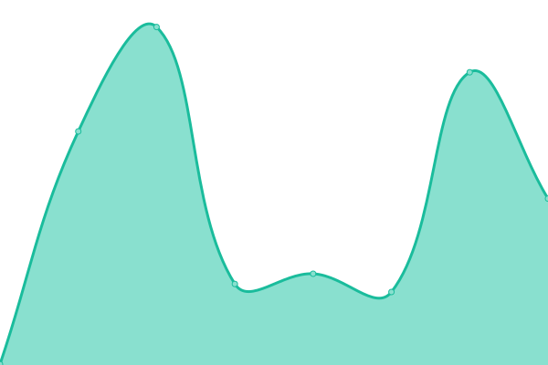

# [📈 Live Status](https://demo.upptime.js.org): <!--live status--> **🟧 Partial outage**

This repository contains the open-source uptime monitor and status page for [Upptime](https://upptime.js.org), powered by [Upptime](https://github.com/upptime/upptime).

With [Upptime](https://upptime.js.org), you can get your own unlimited and free uptime monitor and status page, powered entirely by a GitHub repository. We use [Issues](https://github.com/upptime/upptime/issues) as incident reports, [Actions](https://github.com/upptime/upptime/actions) as uptime monitors, and [Pages](https://demo.upptime.js.org) for the status page.

<!--start: status pages-->
<!-- This summary is generated by Upptime (https://github.com/upptime/upptime) -->
<!-- Do not edit this manually, your changes will be overwritten -->
<!-- prettier-ignore -->
| URL | Status | History | Response Time | Uptime |
| --- | ------ | ------- | ------------- | ------ |
|  [Shoppee](https://shopee.tw/?https://shopee.tw/m/618&gclid=CjwKCAjw7vuUBhBUEiwAEdu2pLKTo2VehlBHE7G66oqJo2bxWsKRIFiCzKmtd7PV-n6mnpBiMa-8CBoCJBYQAvD_BwE#mall) | 🟩 Up | [shoppee.yml](https://github.com/dontkillsheep225/upptime/commits/HEAD/history/shoppee.yml) | 

 1070ms
     
 | 

<a href="https://demo.upptime.js.org/history/shoppee">100.00%</a>
    

|  [Yahoo](https://tw.stock.yahoo.com) | 🟩 Up | [yahoo.yml](https://github.com/dontkillsheep225/upptime/commits/HEAD/history/yahoo.yml) | 

 1704ms
     
 | 

<a href="https://demo.upptime.js.org/history/yahoo">100.00%</a>
    

|  [Hacker News](https://news.ycombinator.com) | 🟩 Up | [hacker-news.yml](https://github.com/dontkillsheep225/upptime/commits/HEAD/history/hacker-news.yml) | 

 358ms
     
 | 

<a href="https://demo.upptime.js.org/history/hacker-news">100.00%</a>
    

|  [Test Broken Site](https://testistest.co) | 🟥 Down | [test-broken-site.yml](https://github.com/dontkillsheep225/upptime/commits/HEAD/history/test-broken-site.yml) | 

 0ms
     
 | 

<a href="https://demo.upptime.js.org/history/test-broken-site">100.00%</a>
    

|  [CNN](https://edition.cnn.com) | 🟩 Up | [cnn.yml](https://github.com/dontkillsheep225/upptime/commits/HEAD/history/cnn.yml) | 

 130ms
     
 | 

<a href="https://demo.upptime.js.org/history/cnn">100.00%</a>
    

|  [BBC](https://www.bbc.com/news) | 🟩 Up | [bbc.yml](https://github.com/dontkillsheep225/upptime/commits/HEAD/history/bbc.yml) | 

 247ms
     
 | 

<a href="https://demo.upptime.js.org/history/bbc">100.00%</a>
    

|  [MOMO](https://www.momoshop.com.tw/main/Main.jsp) | 🟩 Up | [momo.yml](https://github.com/dontkillsheep225/upptime/commits/HEAD/history/momo.yml) | 

 9824ms
     
 | 

<a href="https://demo.upptime.js.org/history/momo">97.35%</a>
    

<!--end: status pages-->

[**Visit our status website →**](https://demo.upptime.js.org)

## 📄 License

- Powered by: [Upptime](https://github.com/upptime/upptime)
- Code: [MIT](./LICENSE) © [Upptime](https://upptime.js.org)
- Data in the `./history` directory: [Open Database License](https://opendatacommons.org/licenses/odbl/1-0/)
